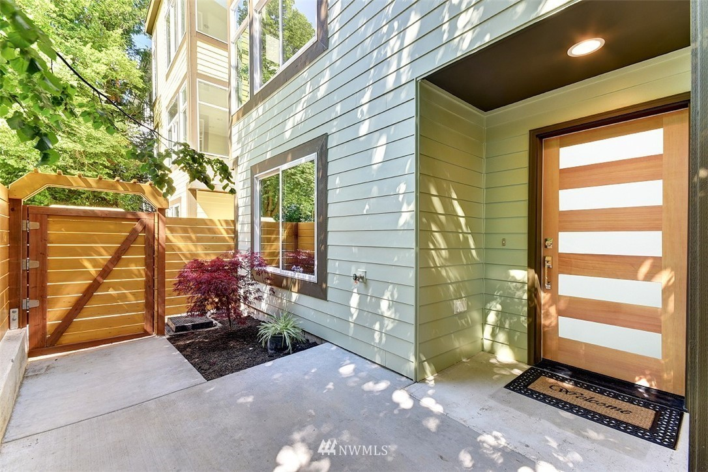
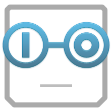

## Stack Overflow in a JAR

[](https://gitter.im/Erudika/scoold?utm_source=badge&utm_medium=badge&utm_campaign=pr-badge&utm_content=badge)

Scoold is a Q&A platform written in Java. The project was created back in 2008, released in 2012 as social network for
schools inspired by StackOverflow, and as of 2017 it has been refactored, repackaged and open-sourced.
The primary goal of this project is educational but it can also work great as a Q&A/support section for your website.

Scoold can run on Heroku or any other PaaS. It's lightweight (~4000 LOC) - the backend is handled by a separate service called
[Para](https://github.com/Erudika/para). Scoold does not require a database, and the controller logic is really simple
because all the heavy lifting is delegated to Para. This makes the code easy to read and can be learned quickly by junior developers.

### Features

- Full featured Q&A platform
- Database-agnostic, optimized for cloud deployment
- Full-text search
- Distributed object cache
- Location-based search and "near me" filtering of posts
- I18n and branding customization
- Spring Boot project (single JAR)
- Reputation and voting system with badges
- Minimal frontend JS code based on jQuery
- Modern, responsive layout powered by Materialize CSS
- Social login (Facebook, Google) with Gravatar support
- SEO friendly

### Live Demo

*Scoold is deployed on a free dyno and it might take a minute to wake up.*
### [Live demo on Heroku](https://live.scoold.com)

### Quick Start

1. Create a new app on [ParaIO.com](https://paraio.com) and save the access keys
2. Click here => [](https://heroku.com/deploy?template=https://github.com/Erudika/scoold)

**OR**

1. Create a new app on [ParaIO.com](https://paraio.com) and save the access keys OR [run it locally](https://paraio.org/docs/#001-intro)
2. Create `application.conf` and configure Scoold to connect to Para
3. Run `java -jar -Dserver.port=8000 -Dconfig.file=./application.conf scoold.jar` OR `mvn spring-boot:run`
4. Open `http://localhost:8000` in your browser

[Read the Para docs for more information.](https://paraio.org/docs)

### Configuration

The most important settings are `para.endpoint` - the URL of the Para server, as well as,
`para.access_key` and `para.secret_key`. Connection to a Para server *is required* for Scoold to run.

This is an example of what your **`application.conf`** should look like:
```
para.app_name = "Scoold"
para.port = 8080
para.env = "development"
para.host_url = "https://live.scoold.com"
para.endpoint = "http://localhost:8080"
para.access_key = "app:scoold"
para.secret_key = "*****************"
para.fb_app_id = "123456789"
para.gmaps_api_key = "********************************"
para.google_client_id = "********************************"
para.admin_ident = "admin@domain.com"
para.auth_cookie = "scoold-auth"
para.support_email = "support@scoold.com"
para.core_package_name = "com.erudika.scoold.core"
para.google_analytics_id = "UA-123456-7"
```

**Note**: On Heroku, the config variables above **must** be set without dots ".", for example `para.endpoint` becomes `para_endpoint`.

## Social login

Facebook is the default identity provider for Scoold, and you don't have to specify you FB app secret.
For "Login with Google" you only need your client id (e.g. `123-abcd.apps.googleusercontent.com`).
For all the other providers, GitHub, LinkedIn, Twitter and Microsoft, you need to set both the app id and secret key.
```
# GitHub
para.gh_app_id = ""
para.gh_secret = ""
# LinkedIn
para.in_app_id = ""
para.in_secret = ""
# Twitter
para.tw_app_id = ""
para.tw_secret = ""
# Microsoft
para.ms_app_id = ""
para.ms_secret = ""
```
You also need to set your host URL when running Scoold in production:
```
para.host_url = "https://your.scoold.url"
```
This is required for authentication requests, which will be redirected back to that address.

## Customizing the UI

- **HTML** templates are in `src/main/resources/templates/`
- **CSS** stylesheets can be found in `src/main/resources/static/styles/`
- **JavaScript** files can be found in `src/main/resources/static/scripts`
- **Images** are in located in `src/main/resources/static/images/`

Also, please refer to the documentation for Spring Boot and Spring MVC.

## Contributing

1. Fork this repository and clone the fork to your machine
2. Create a branch (`git checkout -b my-new-feature`)
3. Implement a new feature or fix a bug and add some tests
4. Commit your changes (`git commit -am 'Added a new feature'`)
5. Push the branch to **your fork** on GitHub (`git push origin my-new-feature`)
6. Create new Pull Request from your fork

Please try to respect the code style of this project. To check your code, run it through the style checker:

```sh
mvn validate
```

For more information see [CONTRIBUTING.md](https://github.com/Erudika/para/blob/master/CONTRIBUTING.md)




## License
[Apache 2.0](LICENSE)
